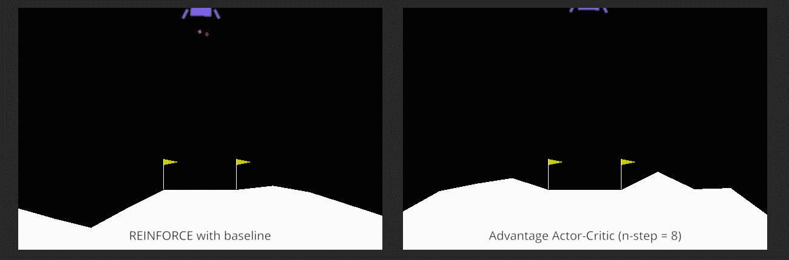
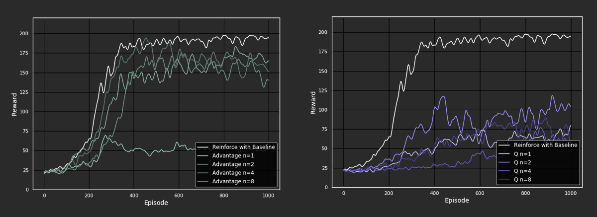
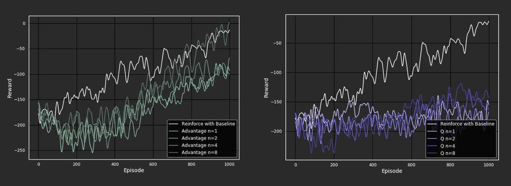
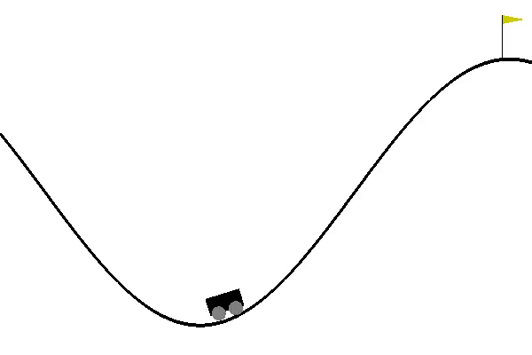
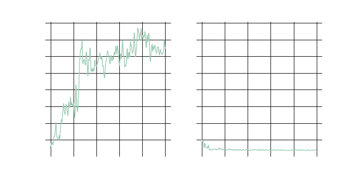
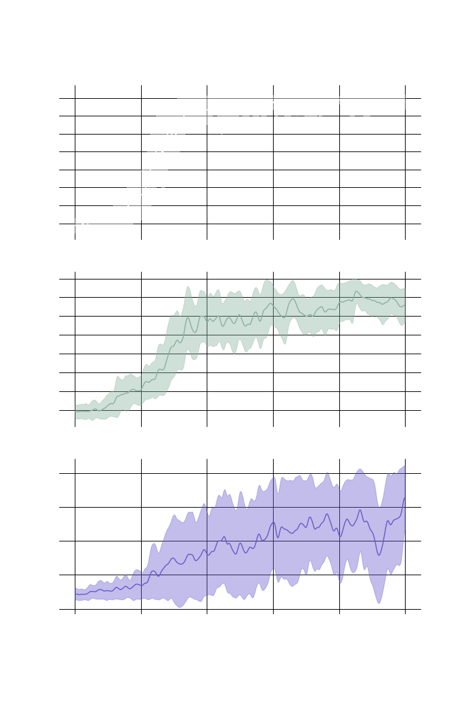
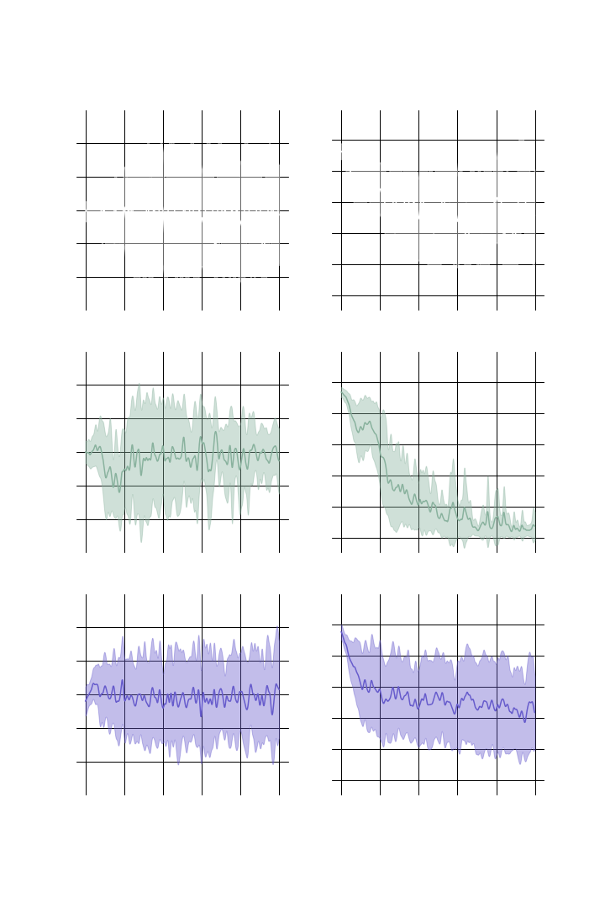
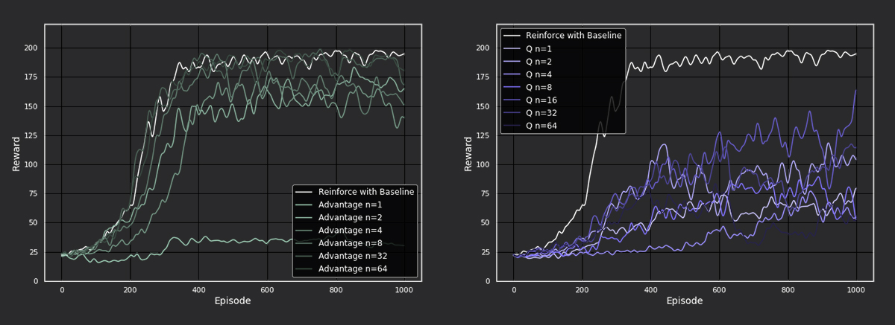
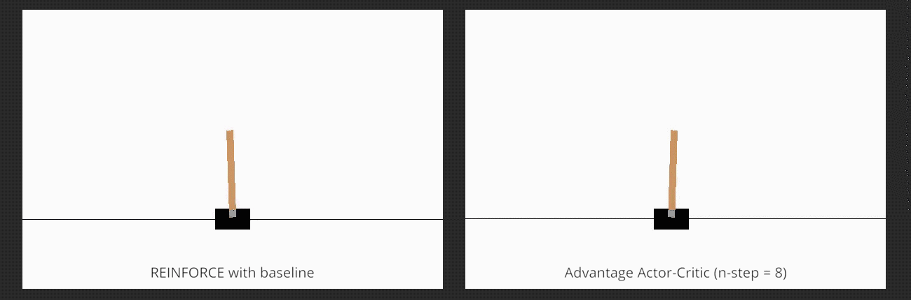

# Tuning variance 

# in actor-critic methods

##### By David Biertimpel, Alex Lindt, 

##### Vicky Foing & Claartje Barkhof

###### University of Amsterdam	|	18 October 2019



Figure 1: Behavior in Lunar Lander environments

## Introduction

Imagine two athletes training for a competition. The first athlete’s coach is a master of his trade, but due to his advanced age teaches techniques which are consistent but slightly antiquated. The second athlete is coached by a rising star just graduated from the academy. Although her instructions fit exactly to the modern sport, she is still inconsistent in her decisions because of her lack of experience. Which athlete will perform better in the competition? This question reflects the bias-variance trade-off in reinforcement learning. While the first athlete exactly learns the *biased* strategy of his coach, the instructions the second athlete receives have high *variance*. 

In this blog article, we investigate bias and variance in actor-critic methods by comparing different n-step bootstrapping returns ranging from TD(0) to Monte Carlo across multiple environments. The core of actor-critic methods is the policy gradient which recently achieved great success in various control tasks such as 3D locomotion [1](https://arxiv.org/abs/1506.02438), playing video games [2](https://openai.com/blog/openai-five/) or solving a Rubik's cube [3](https://openai.com/blog/solving-rubiks-cube/). The biggest advantages of policy gradient methods are that they are predestined for continuous action spaces, implicitly learn stochastic policies, and have overall good convergence properties. However, policy gradient methods have also proven to show high variance in many aspects, such as performance over multiple runs (different random seeds), sensitivity to fine changes in hyperparameters, and low robustness to unexpected changes in the environment [4](http://gradientscience.org/policy_gradients_pt1/), [5](https://arxiv.org/abs/1709.06560). This makes policy gradient methods not always reliable and complicates the reproduction of results. The most obvious source of variance is the variance in sampled trajectories and therefore in the accumulated rewards (return) the agent receives during these trajectories. Here we have a strong incentive to regularize this variance as it hinders accurate gradient estimation, which consequently slows learning. This is why, over the next sections, we investigate various n-step estimates of the return ranging from *high bias* and *low variance* TD(0) to *low bias* and *high variance* Monte Carlo. 

### Policy Gradient Methods

But first, before we dive deep into the topic, let's refresh our knowledge about reinforcement learning and policy gradients. In reinforcement learning our goal is to maximize the future return $G$ the agent receives by interacting with the environment under a specific policy $\pi$:

$$ J = E_{\tau} \bigg[ G(\tau) \bigg]$$ 

In policy gradient methods we directly model the policy with a parameterised (often nonlinear) function $\pi_{\theta}$ such as a neural network and aim to perform gradient updates in the direction of the maximal return. In order to do this, we must take the gradient of return which we achieve by using the following identity:

$$\begin{aligned}\nabla_{\theta} J &= \nabla_{\theta} E_{\tau} \bigg[ G(\tau) \bigg] \\ &= E_{\tau} \bigg[ \nabla_{\theta} \log p_{\theta} G(\tau) \bigg] \\ &= E_{\tau} \bigg[ G(\tau) \nabla_{\theta}  \sum_{t=0}^T \log p_{\theta}(a_t | s_t)  \bigg] \\ &= E_{\tau} \bigg[ G(\tau) \sum_{t=0}^T \frac{\nabla_{\theta}p_{\theta}(a_t | s_t)}{p_{\theta}(a_t | s_t)} \bigg]\end{aligned}$$

### Reinforce

This results in the most basic policy gradient method called REINFORCE. The intuition here is that we make actions connected to a high return more likely. When looking at the last bit of this derivation we also see explicitly that we are correcting for the frequency with which the policy selects actions.

Without getting lost in further mathematical derivations, we can easily imagine that the return of the full trajectory $G(\tau)$ has high variance between episodes, due to stochasticity of the environment’s dynamics and the policy, and that we might want to introduce different estimates of the return. One prominent method to reduce variance is subtracting a baseline from the return, which is then called REINFORCE with baseline. A good candidate for the baseline is the *state-value* function $V_{\pi}(S)$, which describes how much reward the agent is expected to receive from state $S$ onward when following policy $\pi$. Similar to our policy, we can also estimate $V_{\pi}(S)$ with a nonlinear function approximator like a neural net. The intuition behind subtracting $V_{\pi}(S)$ from the actual return is that we separate the action quality from the quality of the current state. This return estimate suffers less from variance, but introduces bias, since $V_{\pi}$ is randomly initialized and does not reflect the true *state-value* in the beginning.

Instead of considering the full return of the trajectory, we can also calculate the TD-target $R_{t+1} + \gamma V_{\pi}(S_{t+1})$ which becomes the TD-error when combined with the baseline $V_{\pi}(S_{t})$. This reduces the variance to a minimum as we are only looking at the next step the agent takes. The intuition for this return estimate is that we are *happily surprised* if the TD-error is positive, since we received more reward than expected and thus increase the probability of the corresponding action. Conversely, in the case of a negative TD-error we receive less reward than expected and disappointedly lower the probability of the corresponding action.

A different instantiation of the TD-error can be achieved by using the *action-value* function $Q_{\pi}(S, A)$. The *action-value* function describes future reward the agent can expect when taking action $A$ in state $S$ and follow policy $\pi$ afterwards. The corresponding TD-error looks like the following $R_{t+1} + \gamma \max_a Q_{\pi}(S_{t+1}, A_{t+1}) - Q_{\pi}(S_t, A_t)$. for the same reasons as $V_{\pi}$, $Q_{\pi}$ is also a biased estimate of the *action-value* function when approximated via bootstrapping.

### Actor-Critic Methods

By using the TD-error instead of the full return, we finally arrive at the methods on which we mainly focus in this article: actor-critic methods. In the case of actor-critic methods we use the $V_{\pi}$ or $Q_{\pi}$ estimates not only as a baseline, but also for bootstrapping (updating the estimate of $V_{\pi}$ or $Q_{\pi}$ with another estimate of  $V_{\pi}$ or $Q_{\pi}$). This bootstrapping introduces a significant bias, which helps reduce variance in the updates and therefore should stabilize and accelerate learning. Actor-critic methods have their name from combining a parameterized policy $\pi_{\theta}$ that decides which actions to take (the actor) and an estimate of $V_{\pi}$ or $Q_{\pi}$ which provides an opinion about the quality of current actions and/or states the agent ends up in (the critic). So the actor tells us *how to act* and the critic tells us *how well we are acting*. As already indicated above, the version of actor-critic we are going to focus on is where the TD-error is used as the critic estimate. This version is called advantage actor-critic because it determines the advantage in the return from taking the action in the current state compared to the expected return in that state.

### Policy Gradient Theorem
Perhaps you are wondering now how on earth we can seamlessly exchange $G$ with all these different return estimates. This is possible because of the Policy Gradient Theorem, which states that for any differentiable policy $\pi_{\theta}$, for any policy objective function $J$ the policy gradient is:

$$g = \mathbb{E}\bigg[\sum_{t=0}^\infty \Psi_t \nabla_\theta \log p_\theta(a_t|s_t) \bigg] = \mathbb{E}\bigg[\sum_{t=0}^\infty \Psi_t \frac{\nabla_\theta p_\theta(a_t|s_t)}{p_\theta(a_t|s_t)} \bigg]$$

where $\Psi_t$ is a placeholder for different return estimates. The derivation of this theorem is actually quite straightforward and is nicely explained in Schulman’s General Advantage Estimation (GAE) paper [1](https://arxiv.org/abs/1506.02438) or for people who prefer visual input in [Hado van Hasselt’s deepmind lecture on Policy Gradients and Actor-Critics at UCL](https://www.youtube.com/watch?v=bRfUxQs6xIM).

### N-step bootstrapping

Now we heard about quite some strategies to choose either a biased (TD-error) or high variance estimate (Monte-Carlo in REINFORCE), however, the choice has been quite binary so far. In order to be able to study the trade-off between bias and variance it would be nice to have some estimates between both extremes. Here n-step returns enter the ring. Instead of bootstrapping with the estimated *state-value* of the next state as in the TD-error before, we also can observe a longer chain of rewards before plugging in the estimated state value. The state value it plugs in might be $n$ steps away, which makes up for the name *n*-step actor-critic methods. N-step returns can be naturally integrated the actor-critic methods described above, as we just have to our TD-target. Where we had $R_{t+1} + \gamma V_{\pi}(S_{t+1})$ before, we can now plug in $R_{t+1} + \gamma R_{t+2} + \dots + \gamma^{n-1} R_{t+n} + \gamma^{n} V_{\pi}(S_{t+n})$. 

If we have $n=\infty$ we get exactly the full Monte-Carlo return $G$ from REINFORCE, by contrast if we leave $n=1$ the method equals the previously described TD-error with a one-step look ahead. 

Based on the theory outlined above, we hypothesise that by tuning the n-step, ranging from one-step actor-critic (high bias) to REINFORCE with baseline (high variance), we can tune the bias-variance trade-off in order to pick a sweet spot dependent on each environment. In other words, we will investigate if different values for $n$ will be beneficial for different algorithm and environments.

## Methods

To make the comparison between different methods as fair as possible we implement them all following the same pseudocode. The general pseudo-code can be laid out as follows:

```
# INITIALISE EXPERIMENT
actor_θ, critic_w ← parameterised functions instantiated as neural networks
ɑ_θ, ɑ_w ← step size for actor and critic respectively

# EXPERIMENT LOOP
for each episode in max_episodes:
    
    # INITIALISE EPISODE
    state ← start state of environment
		𝚿_record, log_probabilities, states, rewards ← []
    
    # EPISODE LOOP
    for each step in episode t=0,1,...,T:
        policy ← actor_θ(state)
        log_probabilities ← log(policy)
        next_state, reward ← environment_step(sample(policy))
        rewards ← rewards + reward
        states ← states + state
        𝚿_record ← 𝚿_record + 𝚿_function(next_state, states, rewards, critic)
        state = next_state
    endfor
   
   	# UPDATE PARAMETERS
   	loss_actor ← mean( - log_probrobabilities * 𝚿  									  																		- log_probabilities.entropy() * 0.01) # polict gradient
    loss_critic ← mean(𝚿**2) 																# mean squared error
    θ ← θ + ɑ_θ * loss_actor
    w ← w + ɑ_w * loss_actor

endfor
```

The different instantiations of $\Psi$ are as follows:

| Algorithm                       | 𝚿_function                                                   |
| ------------------------------- | ------------------------------------------------------------ |
| REINFORCE with baseline         | $\Psi_{t} \leftarrow G_{t} - \hat{v}(S_{t},w)$               |
| Advantage Actor-Critic (1-step) | $\Psi_{t} \leftarrow R_{t} + \gamma\hat{v}(S_{t+1},w) - \hat{v}(S_{t},w)$ |
| Advantage Actor-Critic (n-step) | $\Psi_{t} \leftarrow R_{t+1} + \gamma R_{t+2} + ... + \gamma^{n-1}R_{t+n} + \gamma^{n}\hat{v}(S_{t+n},w) - \hat{v}(S_{t},w)$ |
| Q Actor-Critic (1-step)         | $\Psi_{t} \leftarrow R_{t} + \gamma \max_a Q(S_{t+1},A_{t+1},w) - Q(S_{t},A_{t},w)$ |
| Q Actor-Critic (n-step)         | $\$\Psi_{t} \leftarrow R_{t+1} + \gamma R_{t+2} + ... + \gamma^{n-1}R_{t+n} + \gamma^{n} \max_a Q(S_{t+n},A_{t+n},w) - Q(S_{t},A_{t},w)$ |

In contrast to how the actor-critic procedure is described in Sutton & Barto [6](http://incompleteideas.net/book/RLbook2018.pdf), we do not update our models after every time step in the environment but do a batch update at the end of every episode. This stabilizes our gradients and corresponds to description in related papers and professional implementations online [7](https://github.com/openai/baselines). Inspired by the A2C algorithm [8](https://arxiv.org/abs/1602.01783) we introduce an entropy term in the actor loss reflecting the entropy of the Categorical distribution over the actions. This term flattens out the action probabilities and enforces exploration. 

## Experiments

### Environments

To test our hypothesis we select three control tasks from the OpenAI’s Gym with different characteristics.

#### Cartpole

In this game the goal is to balance a pole on a cart. By moving left and right (a discrete action space) one should try to manage keeping the pole upright. The game is over when the pole drops (more than 15 degrees from being upright) or when the cart moves too far off the track in either direction (measured as 2.4 units). The game ends naturally when the pole is balanced for 200 time steps. A reward of +1 is granted for every step that the pole is in the air. The cartpole environment promises us, with its straightforward state and action space, reliable results, such that it should serve as a stable baseline to compare our different methods.

#### Lunar Lander

In the Lunar lander environment, one has to land a spaceship in between two flags as smoothly as possible. If the spaceship crashes, it receives a reward of -100 and if the spaceship lands smoothly, it receives a reward of +100. The agent has the choice of four actions: Do nothing, Fire left engine, Fire down engine, and Fire right engine. There are additional conditions that influence the agent, such as small punishment (-0.3) for firing the main engine, a small reward (+10) each time a leg touches the ground, wind affecting the orientation of the ship, and a changing landscape. The Lunar Lander environment is a bit more complex as the cartpole both in terms of the reward structure and the fact that the environment slightly changes over different episodes. It is thus interesting to see if our agents will be able to adapt to that.

#### Mountain Car

In Mountain-Car-v0 one has to try to move a little car up onto a hill. The landscape is a part of a cosine curve of which the highest point is the hill. To reach the top of the hill the car has to gain momentum by driving up and down both slopes alternatingly, since its engine is not strong enough to drive up the hill at once. The version of the game we use consists of a discrete action space {left, right}. For every time step the player did not reach the goal yet a -1 reward is returned, so the is incentivised to reach the hill as fast as possible. An interesting property of this environment is that the agent first needs to reach the goal by random exploration before getting the positive reward that allows learning the optimal policy. Due to the requirement of stochasticity, we expect high-variance agents to perform better.

### Experimental set-up & metrics

For each environment, we run experiments with 9 configuration: Reinforce and four versions of each actor-critic algorithm (n=1,n=2,n=4,n=8). Each configuration is run five times, using the same five random seeds. To analyze performance, we store the episode durations, cumulative reward, actor losses, and critic losses, and average across the five runs. These metrics track how quickly and accurately each algorithm learns the reward structure of the environment, which will provide insights into bias and variance.

### Architecture & hyper parameters

All algorithms are implemented using two neural networks, one to represent the Policy estimate and one to represent the Value estimate.

The hyperparameters are as follows:

| Hyper parameter        | Setting                |
| ---------------------- | ---------------------- |
| Learning rate          | 7e-4                   |
| Number of episodes     | 1000                   |
| Discount factor        | 0.99                   |
| Number of hidden nodes | two layers of 64 nodes |
| N-step values          | [1,2,4,8]              |
| Number of runs         | 5                      |
| Random seeds for runs  | [43,44,45,46,47]       |

We select these hyperparameters based on experiments from literature as well as some hyperparameter optimization experiments of our own. To ensure fair comparisons, we keep the values the same for all configurations. 

## Results

### Overall performances

First we look at the overall performances of our implemented methods and see how they compare to our baseline algorithm REINFORCE with baseline.

#### Cartpole

#### 

Figure 2: Performance of the different algorithms on the Cartpole environment

From the above plots, it is evident that REINFORCE with baseline outperforms the actor-critic methods, consistently reaching rewards close to 200 (maximum score) after about 300 episodes. For advantage actor-critic, the performance seems to increase as the n-step value increases. Interesting to note is that the performance for n-step values greater than 1 achieve similar rewards as REINFORCE with baseline, close to 175 after 300 episodes. However, the agent where $n=1$ falls out of line and and stagnates after 250 episodes.

When looking at the Q actor-critic agents we see a different picture. Here we cannot even say that with increasing n-step the performance of the agents improves, as we observe the best behavior from the $n=2$ agent. Overall, the agents do not come close to the performance of the advantage actor-critic agents. A possible reason for this could be that we perform the Q-learning update while bootstrapping ($R_{t} + \gamma \max_a Q(S_{t+1}, a ,w)$) and thus introduce an off-policy aspect into an algorithm that is essentially on-policy.

#### Lunar Lander



Figure 3: Performance of the different algorithms on the Lunar Lander environment

For the Lunar Lander environment, we also see that REINFORCE with baseline outperforms most of the actor-critic methods. In general, the advantage actor-critic methods show a similar performance as REINFORCE with baseline, improving steadily throughout training. In contrast, the Q actor-critic methods do not improve much throughout the 1000 episodes. Again, the advantage actor-critic methods improve as the n-step increases while the Q actor-critic methods do not. What is exciting in the Lunar Lander environment is that at the end of the training, the advantage actor-critic with the highest n-step value, 8, eventually outperforms REINFORCE with baseline, reaching a reward of 0. This suggests that we have found a sweet spot for this particular experiment, where bootstrapping is better than calculating the full return.

#### Mountain Car



Figure 4: Behavior in Mountain Car environment by Q actor-critic (n-step=1)

After a considerable amount of parameter tuning and after running all of our described agents in the Mountain Cari environment, our implementation could not solve the Mountain Car a problem. For reasons we can only speculate about, the agent did not manage to explore enough to reach the top a single time. We assume that because policy gradient methods are on-policy and the exploration is determined by the distribution over actions, the evenly distributed reward of $-1$ is not enough to enforce enough exploration. Most of our agents perform as shown in the gif above.

### Comparing random seeds



Figure 5: Performance of one step Advantage Actor-Critic on cartpole environment with different seeds

To illustrate the variance over the several runs previous sections, we will now look at two completely identical agents living in the same environment, where the only difference is the selected random seed. While the left agent solves the task almost perfectly reaching the maximum possible reward (not visible due to smoothing), the right agent fails horribly by ranging between 5 and 10 reward over the whole episode. This shows how dependent policy gradient methods are on having a good initialization. In this case we further see another disadvantage of policy gradient: a bad policy leads to bad data. So if the agent behaves suboptimally after some *wrong* updates in the policy space, the collected data will also be suboptimal. In some cases this can lead to the agent not being able to recover from that. 

### Variance-bias debate

--> TEXT <---

Figure 6: Cumulative rewards plotted with variance over 5 runs during training for different algorithms

Figure 7: Actor and critic loss plotted with variance over 5 runs during training for different algorithms

### Larger N

We run one more experiment with the CartPole environment to see how larger values for n will influence performance. The n-step values used are [1,2,4,8,32,64].



Figure 8: Performance of higher n-step actor-critic methods on cartpole

Here we see that the advantage actor-critic methods with larger n-step values 32 and 64 perform better than the methods with the smaller n-step values. This time, we have found two n-step values that perform just as well as REINFORCE with baseline! For Q actor-critic methods, larger n-step values did not improve performance. An explanation for the positive effect of larger N on the performance could be that the algorithm performs like REINFORCE when the length of the episode is smaller than N (beginning of training), while when the episodes get longer (end of training) than N it is a bit more stable than REINFORCE because it makes use of bootstrapping.

### Behavior



Figure 9: Behavior simulation in Cartpole environment

When visualizing the trained agents, we can observe some cool differences in behavior!
In the Cartpole environment, we see that at 1-step, the actor-critic agents typically fail to balance the pole for more than a few seconds and do not get a reward above 20. For n-step values greater than 1, the advantage actor-critic agents do a decent job of balancing the pole however they are inclined to move to one side while balancing it, which leads them to drop it. For Reinforce with baseline, the agent learns to balance the pole well by making small movements from left to right.

In the Lunar Lander environment, we see that the three agents have different approaches to landing the spaceship. The advantage actor-critic agent slowly lands by swaying from side to side (making use of the left and right engine), and learns to improve landing as the n-step increases, while the Q actor-critic agent comes crashing down quickly in all experiments. In general, the Reinforce agent has a more direct landing, but does not come to a halt after touching the surface and keeps firing its engines, which decreases reward. Check out the Figure 1 at the top of the page to see this comparison!

The Mountain Car environment is too challenging and does not result in different behaviors. All agents remain stuck in the valley, rolling from left to right.

## Conclusion

<-- TEXT -->

## Citations

[1] High-dimensional continuous control using generalized advantage es-timation - https://arxiv.org/abs/1506.02438 

[2] OpenAI Five - https://openai.com/blog/openai-five/

[3] Solving Rubik’s Cube with a Robot Hand - https://openai.com/blog/solving-rubiks-cube/

[4] A Closer Look at Deep Policy Gradients - http://gradientscience.org/policy_gradients_pt1/

[5] Deep Reinforcement Learning that Matters - https://arxiv.org/abs/1709.06560

[6] Reinforcement Learning: An Introduction - http://incompleteideas.net/book/RLbook2018.pdf

[7] OpenAI Baselines - https://github.com/openai/baselines

[8] Asynchronous Methods for Deep Reinforcement Learning - https://arxiv.org/abs/1602.01783

[9] Are Deep Policy Gradient Algorithms Truly Policy Gradient Algorithms? - https://arxiv.org/abs/1811.02553 